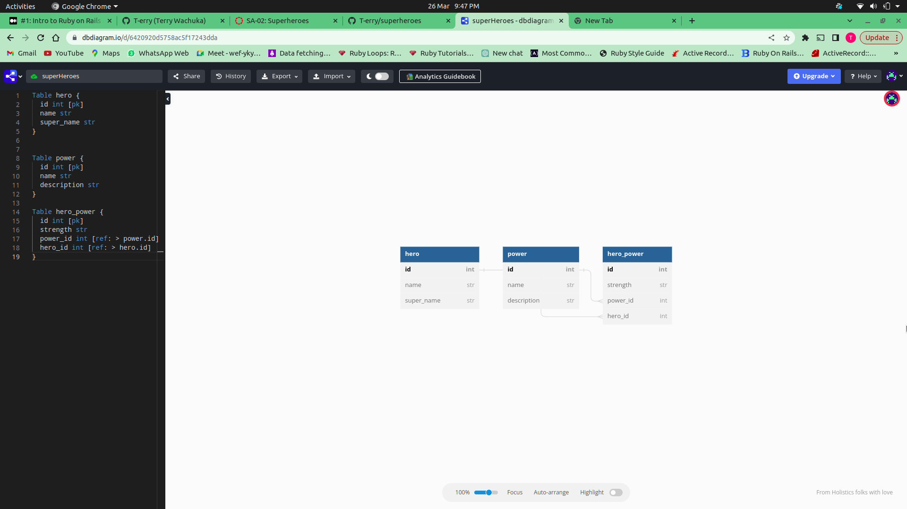

### PHASE 4 CODE CHALLENGE WEEK 1

#### Projects name

    - Pizza Restaurant

#### author information

    The following projects are created by:
    - Terry Wachuka
    
####  System dependencies
check GEMFILE

#### Configuration
- rails db:migrate 
- rails server 

#### Database creation
- rails db:migrate 
- rails server 

#### Database initialization
- sqlite in use , add extension on VS code.

#### setup/installation requirements

    - download a zip file under code tab.
    - extract the downloaded zip folder
    - open the folder with VS code
    - Run this command on the terminal to run server:
    console $ rails server
    - Use Postman to view the data through routes in BDD

##### ERD

##### BDD

As a user should;

    ##### BDD

As a user should;

    - GET /heros return all heros in an array

    - GET /heros/:id return the heros matching the id together with a power array including all powers related to the heros.

    - GET /powers return all powers in an array

    - GET /powers/:id return the powers matching the id.

    - PATCH /powers/:id return an updated power object.

    - POST /hero_powers create a hero_powers instance that is associated with an existing `Hero` and `Power'
    

##### Known Bugs

    The application works perfectly well, no bugs.

#### technologies used

    The following projects used the technologies
    :
    - RUBY, 2.7.4
    - RAILS
    - Active Record

#### Support and Contact information

    Email: terrywachuka10@gmail.com
    

#### License and Copyright Information
Licensed under [MT License] ("https://github.com/T-erry/superheroes/blob/main/LICENSE.md") 

